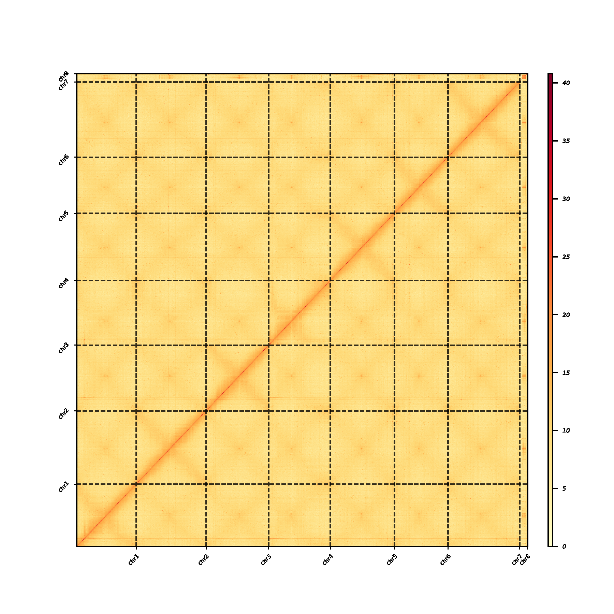

# Juicerbox results to bin matrix for plotting

It is very fast to convert juicerbox output to bin matrix for plotting.

## Need CPU and memory

for example: **120GB** nodup.txt.gz file need 150GB memory and cpu 2-64 core

###

## windowse Usage

```bash
juicerbox2matrix.exe -h

juicerbox to matrix v0.0.1
juicerbox2matrix 0.0.2
Yu kaiquan <1962568272@qq.com>
Convert juicerbox output to bin matrix

USAGE:
    juicerbox2matrix.exe [OPTIONS] --input <FILE> --assembly <STRING> --output directory <FILE> --chr_num <INT>

FLAGS:
    -h, --help       Prints help information
    -V, --version    Prints version information

OPTIONS:
    -a, --assembly <STRING>          assembly file is from juicerbox output file
    -b, --bin <INT>                  bin size for matrix (default: 500000) [default: 500000]
    -c, --chr_num <INT>              chromosome number
    -i, --input <FILE>               nodups.txt/nodupe.txt.gz file
    -o, --output directory <FILE>    output directory
    -t, --threads <INT>              threads number (default: 1) [default: 8]

# example
juicerbox2matrix.exe -a .\genome.final.review.vv9.assembly.assembly -c 8 -i .\Ad_merged_nodups_test.txt.gz -o test
```

## linux Usage

```bash
juicerbox2matrix -h

juicerbox to matrix v0.0.1
juicerbox2matrix 0.0.2
Yu kaiquan <1962568272@qq.com>
Convert juicerbox output to bin matrix

USAGE:
    juicerbox2matrix_wsl [OPTIONS] --input <FILE> --assembly <STRING> --output directory <FILE> --chr_num <INT>

FLAGS:
    -h, --help       Prints help information
    -V, --version    Prints version information

OPTIONS:
    -a, --assembly <STRING>          assembly file is from juicerbox output file
    -b, --bin <INT>                  bin size for matrix (default: 500000) [default: 500000]
    -c, --chr_num <INT>              chromosome number
    -i, --input <FILE>               nodups.txt/nodupe.txt.gz file
    -o, --output directory <FILE>    output directory
    -t, --threads <INT>              threads number (default: 1) [default: 8]

# example
juicerbox2matrix -a ./genome.final.review.vv9.assembly.assembly -c 8 -i ./Ad_merged_nodups_test.txt.gz -o test
```

## Output

in output directory, there are 2 files:

1. Hicmatrix.txt
2. axesTicks.csv

## Plot

In this time,you can use [plotHixGenome](https://github.com/Atvar2/plotHicGenome) to plot matrix.

```bash
plotHicGenome juicer ./Ad_merged_nodups.txt.gz ./genome.final.review.vv9.assembly.assembly -H ./test/Hicmatrix -W whole -n 7 -s True -l t -F 4 -r 500000 -X 2 -w 0.5 -d 3 -S 'dashed' -i 300 -z 6,6 -C 'black' -L 0.8 -A 0.8 -B  '1%' -D 0.2 -o Juicerbox.pdf -R ./test
```

**Picture**:


## Acknowledgements

### Thanks to the following projects:

- [plotHicGenome](https://github.com/Atvar2/plotHicGenome)
- [juicer](https://github.com/aidenlab/juicer)
